# Electric bicycle conversion

- License: MIT License
- Author: Matteljay
- Language: Arduino C
- Homepage: https://github.com/Matteljay

## Introduction

Introductory videos: [bitchute.com](https://www.bitchute.com/video/TFtoIIF0EaJG) [youtube.com](https://youtu.be/klWlLkqpsk8)

This project explains my personal experiences while converting a regular bike to an e-bike. The only selection criterion for the regular bike was the [derailleur gear system](https://en.wikipedia.org/wiki/Derailleur_gears). Many bikes in my part of the world have an internal [planetary gear system](https://en.wikipedia.org/wiki/Epicyclic_gearing). Since I wanted rear-wheel drive, this was not an option.

The project escalated to include other side-projects such as building a spot welder for the 18650 battery cells and hacking an [SMPS](https://en.wikipedia.org/wiki/Switched-mode_power_supply) to add a current limiting feature for battery recharging. The source code for the [ATtiny85 micro controller](https://www.microchip.com/wwwproducts/en/ATtiny85) based spot welder is available for download on this page. As well as a reverse-engineering schematic of the Chinese PSU. Clone the source folder to browse through all the pictures and schematics at a bigger scale.

It was a great practical learning experience to create this usable product. A word of caution however, the finished product lacks many safety features, is over-powered, uses a flimsy thumb-throttle for speed control (which could hang up!) and has no license or insurance coverage whatsoever. In fact, it is [quite dangerous](img/dangerous.jpg) and probably not legal on public roads anywhere.

Do not start this project if you actually want an approved e-bike for daily commuting purposes. Buy one, that will save you time and worries on the road. If you do want to build (parts of) this project then always use specialized gloves and protective glasses for your eyes!
DISCLAIMER: this project works with high voltages, dangerous currents, high temperature welding & soldering and a potentially uncontrollable vehicle. I take no responsibility for any harm resulting to you or others from attempting to recreate any part of this project.

## Mechanical montage

Base parts used for the conversion from eBay, all manufactured in China:
- Bafang/8Fun 500W hub motor
- Sunwin 1500W SH48U45GV18T-WZ1 motor controller
- Universal 3-wire thumb throttle

### Testing the above components for compatibility

If you're like me, you'll first want to see the stuff you bought in action before investing more time. So I got a few old alarm system batteries from the disposal bin of a utility company. Then charged them individually with a car battery charger and connected 4 of them in series to give at least 48V.

Let's have a look at the controller. The voltage cuts off at 42V, higher DC voltages (tested up to 72V) didn't seem to give any trouble and increases motor torque.

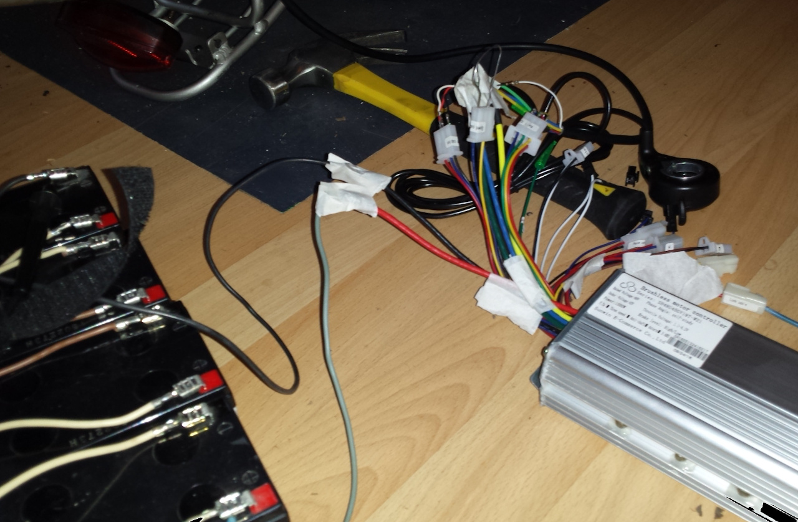

Of course the seller's schematic is your primary source of wiring info. In my case this wasn't quite sufficient and some testing was needed. Used wiring layout:
- Thick motor phase cables: yellow, blue, green
- Red lock cable put through to positive battery voltage
- Thin hall cables: red, black, yellow, blue, green
- Black ground cable
- Throttle: red, blue (to white)
- Brake low cable: brown
- Lights: used astern plug for stable voltage source
- Speed cables: yellow+black = normal, yellow+blue = fast, blue+black = super fast
- Hall sensor self-study cables (white in my case) work like this: [video by Teamtestbot](https://youtu.be/nuiNmyTZmXQ)

After seeing some action I was ready to start taking this project seriously.

### Installing the rear wheel hub motor

The first seemingly tedious task is spoke-weaving the new rear wheel. You need to find a wheel rim, a regular wheel was disassembled here. Unscrew all the spokes with this [wrench](img/mech/spoke.tool.jpg). Next you will be inserting the larger Bafang hub so you need to calculate your required spoke length. The hub motor and weaving diagrams:

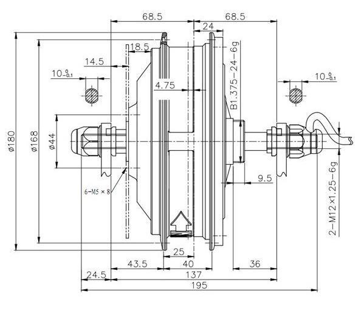

Note that my motor included a [freehub cassette mount](https://en.wikipedia.org/wiki/Freehub) which does not matter for the spoke length or the center placement of the hub. If you don't trust the [Pythagorean theorem](https://en.wikipedia.org/wiki/Pythagorean_theorem) to calculate your spoke length, you can double check it with this [LibreOffice Calc sheet](spocalc_8fun.hub.ods). To finish up the hub you'll need to buy a fitting [cogset](https://en.wikipedia.org/wiki/Cogset). I got mine from [Decathlon](https://www.decathlon.com/) and needed to order a freehub spacer ring there as well. Final step for the bike mechanics is to properly wire your controller to all the desired parts of your bike.

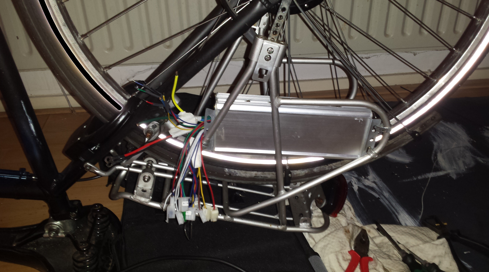
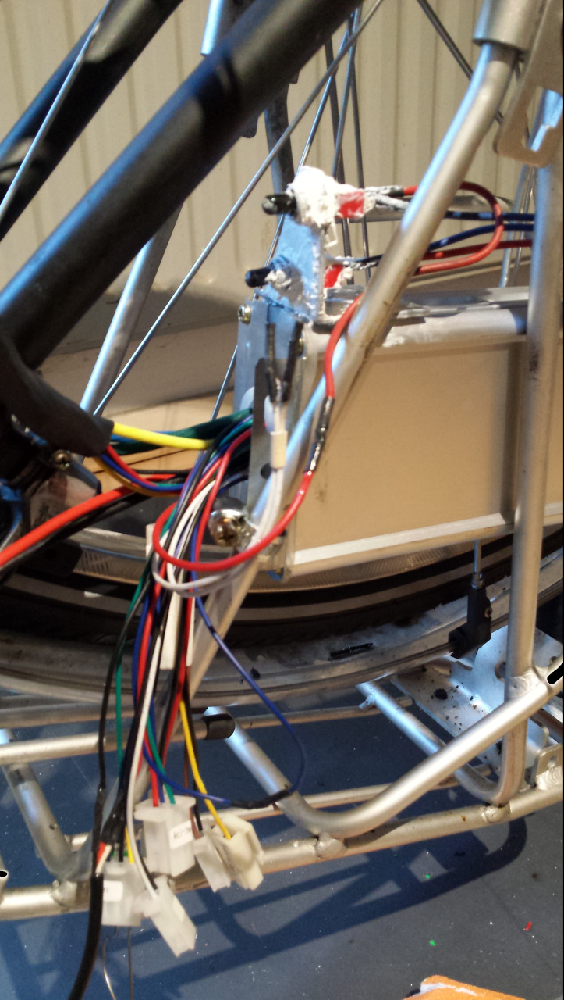
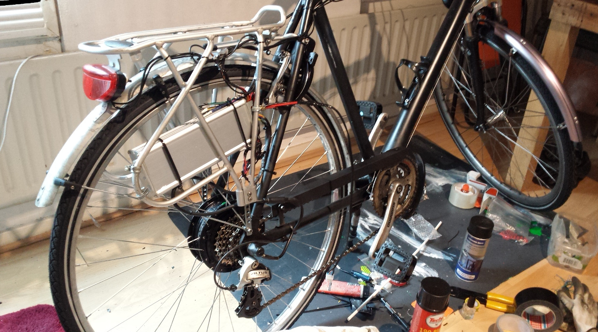

These images can help guide you, note the [toggle switches](https://www.electronicshub.org/switches/#Toggle_Switch) with rubber cover are used for the e-bike lights and the overall power on/off. They are coated with silicone caulk for water proofing and later [painted black](https://youtu.be/O4irXQhgMqg).

## E-bike battery introduction

A proper Li-ion battery in the 42-72 voltage range is not that easy to find and far from cheap. The idea of being able to construct your own power sources from recycled 18650 battery cells seems appealing. This skill can be used to repair or upgrade all kinds of portable consumer electronics. I was told by a battery recycling firm that I should use all of the same type of 18650 cells and use a [BMS](https://en.wikipedia.org/wiki/Battery_management_system) for my pack. I was given plenty of cells to make one! With this amount of luck I got really motivated to DIY my e-bike battery pack.

The cells I got were of type Sony US18650V and still had about 4V potential difference across them:

If you're going to buy new ones, consider the [Samsung INR18650-25R](https://duckduckgo.com/?q=Samsung+INR18650-25R). Note however, your first battery pack will not be the prettiest and you may destroy quite a few cells. So breaking open old laptop batteries to harvest your 18650s may be the least wasteful option to get some practice.

Note my goal was to build a pack first. Then deal with the problem of charging 18650s later. To build it, soldering or clamping the individual cells seems possible according to other people on YouTube. But spot-welding is the most space-efficient and you have less chance of over-heating the sensitive chemistry in the cells.

The idea here is to start with building a 13s4p Li-ion pack. That means 13x4=52 cells are needed where they are first arranged in groups of 4 cells in parallel: welding all the pluses and minuses in line, then 13 of those groups are connected in series: welding pluses of one group to minuses of the next group. The parallel connections increase the capacity (4x1600mAh), the zig-zag series connections will increase the voltage (13x4V). [GreatScott](https://youtu.be/b2sBhDxmPmA) explains this in more detail.

## Building a nickel strip spot welder for 18650 Li-ion batteries

Rough idea: get a 12V car battery with a high [CCA](https://en.wikipedia.org/wiki/Automotive_battery#Cranking_amperages_(CCA,_CA,_MCA,_HCA)) and create a short circuit with 2 copper rods on the spot you'd like to weld for about 60 milliseconds. Sounds simple? Rest assured that it is far from easy to implement in reality. Let's have a look at my first not-so-great attempts and discuss the problems:

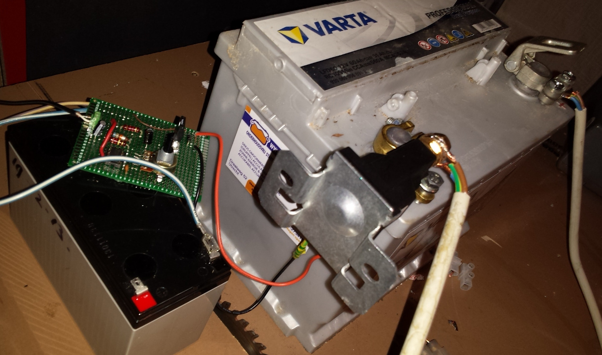

The first 2 are based on an NE555 timer IC to generate the short open-close time (square wave pulse). It operates the biggest mechanical relay I could find for sale via a separate 12V battery. Problems:
- Inconsistent pulses, the mechanical relay is not reliable enough to trust that 2 welds will have the same opening time. Also, the minimum opening time is too long so the pulse is too strong.
- A foot switch is required (the fat black wire on top), there is no sensor option to see if the contacts are touching a metal surface.
- No ability to correct for accidental double-pulses. As you may know: push buttons are not perfect, there is a good chance of getting multiple button-presses when you intend to push only once.
- Bulky and noisy setup: the mechanical switch is just not very subtle.

Now the 3rd image showcases an [Arduino Nano](https://store.arduino.cc/arduino-nano) this is starting to function more like my end solution. Problem here was that the electrical switch (4x MOSFET) are destroyed after a few pulses. One tiny transistor is operating the FETs. If I had an oscilloscope, I could probably confirm the problem was the non-squareness of the operating pulse. Meaning a slow open-close time is responsible for the FET's over-heating. Also, this setup was not equipped yet with a nice auto-pulse sensor feature. So I was still using a buggy foot switch.

Let's start looking at the solution I was happy with:

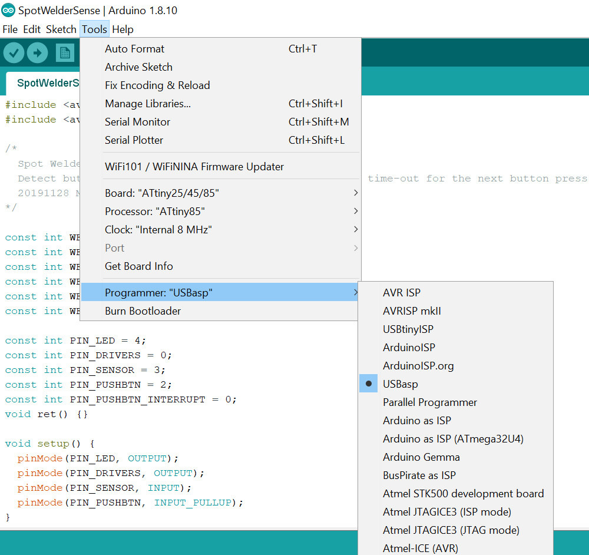

The first image shows the programming setup for the ATtiny85 micro controller. It is attached to an [USBasp](https://www.fischl.de/usbasp/) on a Windows 10 laptop with [Zadig drivers](https://zadig.akeo.ie/) installed. The C programming language based [Arduino IDE](https://www.arduino.cc/en/Main/Software) was used to compile and upload sketches. It is important for the ATtiny85 to set the 'Additional Boards' option as explained [here](https://www.instructables.com/id/How-to-Program-an-Attiny85-From-an-Arduino-Uno/). Set the correct programmer settings as shown in the second picture and use the menu bar option Sketch->'Upload Using Programmer'. The third image shows the debug button in action, it will trigger the welding circuit for 15 whole seconds, great for tests with a 12V car light bulb, NOT for welding!

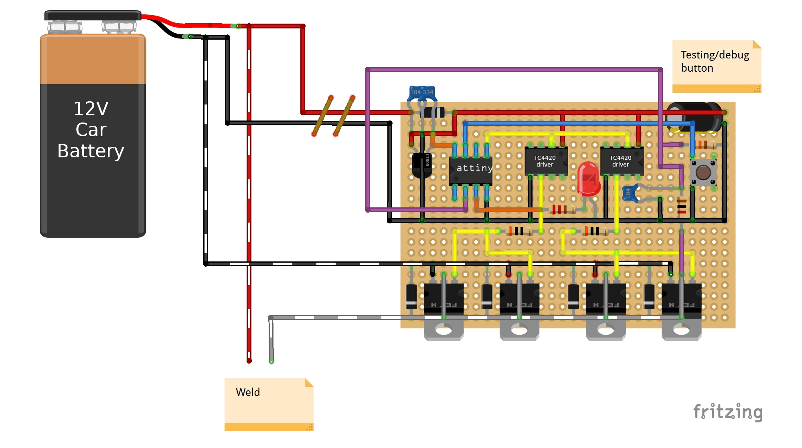

The above images show the spot welder. Note that an active cooling fan pointed at the aluminum heat sink is required if multiple welds are made in a short time. What I really like is the auto-pulse sensor: the LED lights up when the nickel ribbon is touched with the electrodes. After one second of warning the main pulse performs the weld which you can change in the source code. If the brass rods stick to the weld, there is NO second pulse until you gently wiggled off the electrodes. The trigger sensor is ready again after one additional second of safety margin to prevent multiple pulses, all settings can be easily be adjusted in the [sketch](SpotWelderSense.ino).

The 3rd one show the working diagram, it was created using the [Fritzing](https://fritzing.org/home/) electronics CAD software and [GIMP](https://www.gimp.org/) to correct some component names. To summarize: the L7805 powers the ATtiny85, which powers 2x TC4420 MOSFET drivers which power 8x IRF1404 MOSFETs, protected by 8x P6KE13A diodes (only 4 of each are drawn in the diagram). The main pulse comes from my Varta LFD60 with a CCA of 560A.

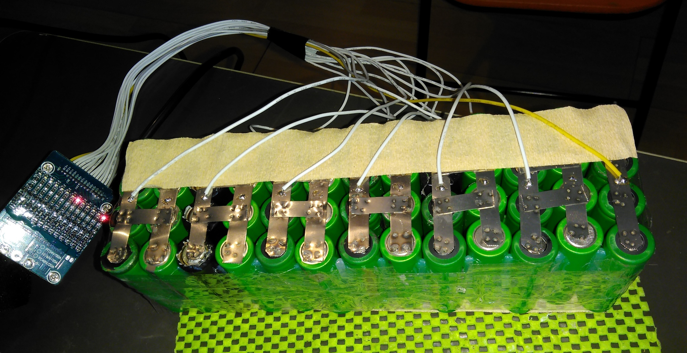

Later this pack was upgraded with 2 more parallel groups of 4 cells to create a 15s4p pack. The controller can easily handle the higher voltage, the battery pack was not empty at the 42V cutoff and this coincides with the charger's voltage limit.

## Converting a 60V LED switch mode power supply to an 18650 cell charger

Let's have a look at the acquired [LED SMPS](https://www.ebay.de/itm/350W-60V-5-8A-Single-Output-Switching-power-supply-AC-TO-DC-for-CNC-Led-strip/261881433541), again from China:

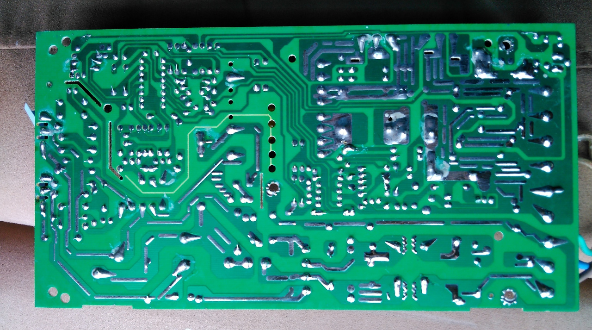

Now the homework becomes interesting. Let's first try to understand the basic principle of an SMPS. If you hardly have any electronics skills, now is the time to start watching [ALL](https://www.youtube.com/user/greatscottlab/videos?view=0&sort=da) of GreatScott's YouTube videos. At the time of this writing, he has about 300 public videos with an average length of 8,5 minutes. Good luck with learning [Matrix-style](https://youtu.be/OBxMsUxXcXU) at least one week full time. Many thanks to him for basically providing an entire education on YouTube!

We're going to zoom in particularly on this video: [GreatScott - HACKED: Adding a Current Limit Feature to a Buck/Boost Converter](https://www.youtube.com/watch?v=8uoo5pAeWZI). There is also a [bug-fixed text version](https://www.instructables.com/id/Adding-a-Current-Limit-Feature-to-a-BuckBoost-Conv/).

After having a look at all the ICs in the PSU, you'll find quite a few big transistors and an opamp but nothing too interesting. Except for... the big 16 pinned [TL494 PWM controller](TL494-datasheet.pdf). You should understand by now that this is the "brain" of the SMPS. Your guess might be that something needs to be done with the feedback pin-3 and/or the error amplifiers and you'd be correct.

Luckily I wasn't the only person on the planet interested in modifying an affordable SMPS with the willingness to write about it. [Imajeenyus](http://www.imajeenyus.com/electronics/20151028_smps_variable_voltage/) did some serious reverse-engineering on a similar 12V SMPS, albeit for a different [purpose](https://youtu.be/JL4FS4QOd0M). Personal permission was granted to include his [PDF schematic](s-400-12_supply.pdf) in my source repository, well worth studying if you want to understand how they work.

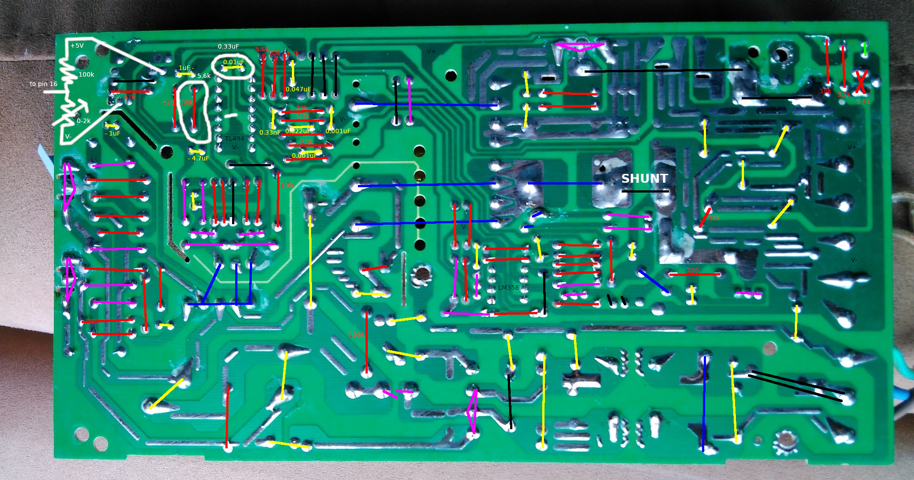

Okay so what is happening here? In a nutshell the TL494 has 2 error opamps which are used as feedback comparators that determine if the PSU duty cycle should be increased or decreased. To be more precise: pin 1 + pin 2 and pin 16 + pin 15 form 2 Schmitt triggers with the common opamp feedback from pin 3. Again, [GreatScott](https://youtu.be/woTiKij76cA) has a fantastic conceptual resource on this topic. If you want to dig deeper then there is a nice [TL494 design sheet](TL494-design.pdf). If you want to dig even deeper you'll end up in specialized opamp circuits and mathematical differential equations. Suffice it to say that roughly copying the feedback R-C circuit from the existing voltage-feedback Schmitt trigger on pin 1 + pin 2 was enough to integrate and dampen the instability introduced by treating pin 16 + pin 15 like a simple comparator.

Let's talk a bit more big-picture: when you're pulling a larger current from the PSU on the DC side, the voltage starts to decrease over the short metal wire labeled "SHUNT" (don't modify that part, it is a working current sensor). For example with no load I measured at pin 15 about 49.8mV. Increasing to 1A: 49.1mV, at 2A: 48.6mV. Now for pin 16: via a [voltage-divider](https://en.wikipedia.org/wiki/Voltage_divider#Resistive_divider), the 5V reference voltage is reduced to a variable but stable reference in roughly the same millivolt range. Let's say we set it to 49.1mV. Now if pin 15 reduces further below 49.1mV, the PSU duty cycle starts to decrease to prevent that from happening. Originally I tried this without any feedback to the comparator. You'll get high-pitch transitional noises as the comparator cannot offer a stable state. In the first picture I tried amplifying those millivolt ranges with an LM358 dual opamp and chaining comparators but that didn't help. You need to treat that error amplifier more like a Schmitt trigger and include the feedback as explained above.

In my diagram you can see the required modifications marked with a white color (except for the shunt, leave it alone). Break the ground connection from pin 16 by heavily scratching the PCB, that is important. Then connect pin 16 up to a variable voltage divider as shown. Then for the R-C feedback circuit from pin 3 to pin 15: decrease the R and increase the C, similar to the other error amplifier feedback. Again, clone the source folder to browse through all the pictures and schematics at a bigger scale. Happy current limiting!

The charger was set to just below 2A max current to charge the e-bike battery which fills it up in a few hours. Happy e-biking & keep safe! If you received value from this article, don't feel ashamed to buy me a coffee via a small [donation](CONTACT.md) :-)

